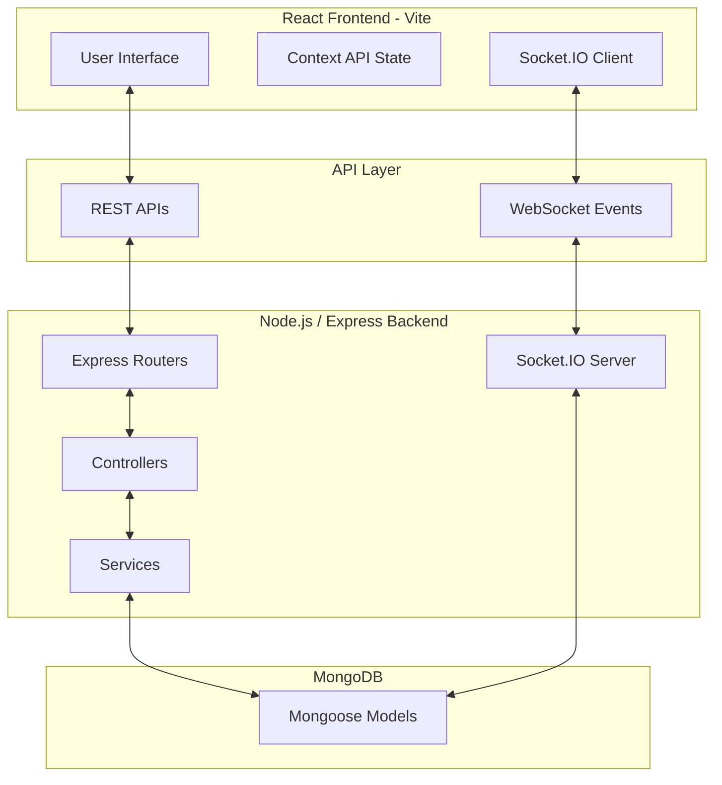
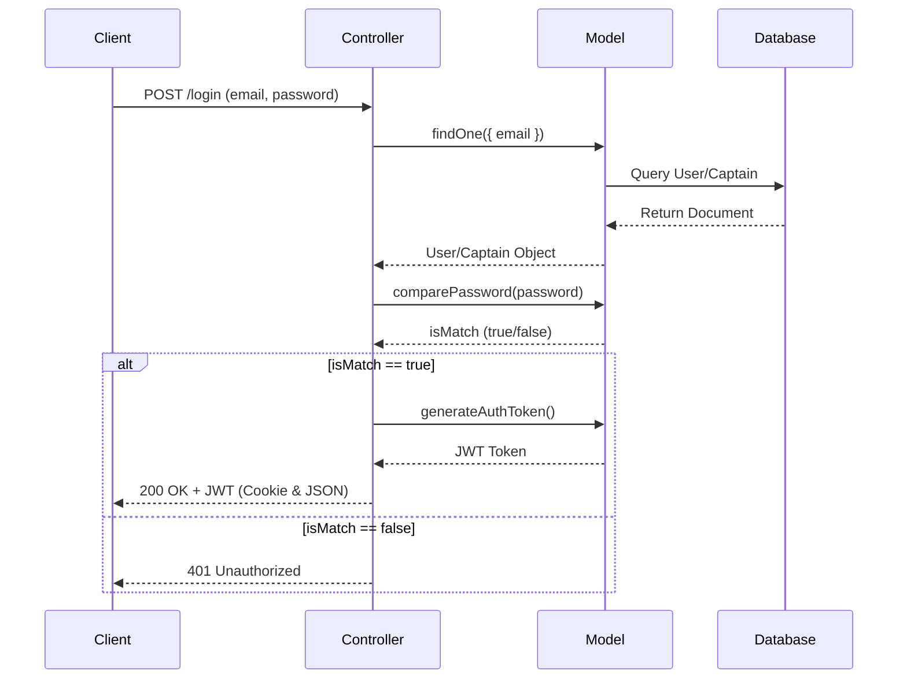
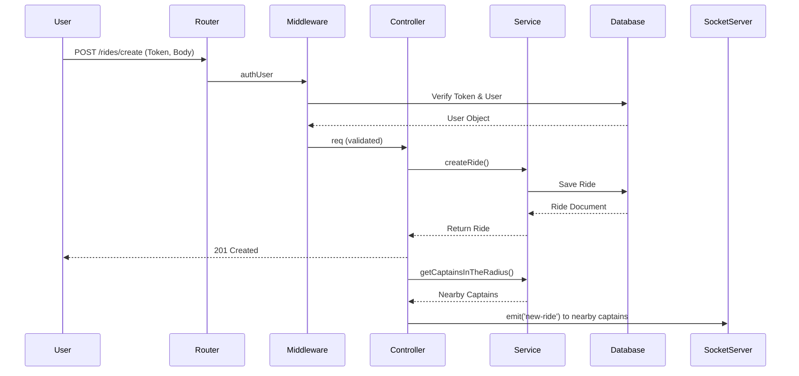

<div align="center">

# 🚕 Uber Clone

**A full-stack ride-hailing platform with real-time driver matching, live tracking, and fare estimation.**

Built with React, Node.js, Express, MongoDB, and Socket.IO.

[](https://nodejs.org/)
[](https://react.dev/)
[](https://www.mongodb.com/)
[](https://socket.io/)


[Features](#-features) • [Architecture](#-architecture) • [Getting Started](#-getting-started) • [API Reference](#-api-reference) • [Roadmap](#-roadmap)

</div>

---

## 📖 Overview

Uber Clone is a full-stack ride-hailing application that connects **Users** (riders) with **Captains** (drivers) in real time. It supports secure authentication, live location tracking, geospatial driver matching, and dynamic fare calculation powered by the Google Maps API.

| | |
|---|---|
| **Status** | Active development |
| **Type** | Full-stack monorepo (Backend + Frontend) |
| **Backend** | Node.js, Express, MongoDB, Socket.IO |
| **Frontend** | React (Vite), Tailwind CSS |

---

## ✨ Features

- 🔐 **Dual Authentication** — separate, JWT-secured signup/login flows for Users and Captains, with `bcrypt` password hashing.
- 📍 **Live Driver Matching** — geospatial queries (`$geoWithin`) find nearby captains within a configurable radius and notify them instantly over WebSockets.
- 🚗 **Ride Booking** — location search/autocomplete, distance & time estimation, and fare quotes across vehicle types (auto, car, moto).
- 🛰️ **Real-Time Tracking** — Socket.IO powers live captain location updates and ride-status events (`new-ride`, `ride-confirmed`, `ride-started`, `ride-ended`).
- 💰 **Dynamic Fare Calculation** — computed from live distance/duration data with per-vehicle base and per-km/per-minute rates.
- 🗺️ **Google Maps Integration** — geocoding, distance matrix, and place autocomplete.
- 👤 **Profile & Session Management** — protected profile routes and secure logout via JWT blacklisting.

---

## 🏗️ Architecture

The application uses a client-server model with a REST API for standard operations and WebSockets for real-time events.



The backend follows a layered pattern: **Routes → Middleware → Controllers → Services → Models → MongoDB**, keeping validation, business logic, and data access cleanly separated.

---

## 🧰 Tech Stack

| Category | Technology | Purpose |
|---|---|---|
| Frontend Framework | React.js (Vite) | Fast, component-based UI |
| Styling | Tailwind CSS | Utility-first responsive styling |
| Backend Framework | Express.js (Node.js) | REST API layer |
| Database | MongoDB + Mongoose | Flexible schema, geospatial queries |
| Real-Time Engine | Socket.IO | Live location & ride-status events |
| Authentication | JWT + bcrypt | Stateless auth & secure password storage |
| Validation | express-validator | Request payload validation |
| External API | Google Maps API | Geocoding, distance matrix, autocomplete |
| Icons | Remix Icon | UI iconography |

---

## 📁 Project Structure

```text
uber-clone/
├── Backend/
│   ├── app.js                 # Express app setup
│   ├── server.js              # HTTP & Socket server entry point
│   ├── socket.js              # Socket.IO configuration and events
│   ├── db/
│   │   └── db.js              # MongoDB connection setup
│   ├── controllers/           # Route handlers (user, captain, ride, map)
│   ├── middlewares/           # Custom middleware (authentication)
│   ├── models/                # Mongoose schemas (user, captain, ride, blacklistToken)
│   ├── routes/                # Express route definitions
│   └── services/              # Business logic and database interactions
└── frontend/
    ├── index.html              # Vite entry point
    ├── src/
    │   ├── App.jsx              # Root component and routing
    │   ├── main.jsx             # React DOM render and context providers
    │   ├── components/          # Reusable UI components
    │   ├── context/             # Global state (User, Captain, Socket)
    │   └── pages/                # Page-level views
    ├── public/                  # Static assets
    └── vite.config.js           # Vite bundler configuration
```

---

## 🚀 Getting Started

### Prerequisites

- [Node.js](https://nodejs.org/) v18 or higher
- [MongoDB](https://www.mongodb.com/) (local instance or Atlas)
- A [Google Maps API](https://developers.google.com/maps) key with Geocoding, Distance Matrix, and Places enabled

### 1. Clone the repository

```bash
git clone <repository-url>
cd uber-clone
```

### 2. Backend setup

```bash
cd Backend
npm install
```

Create a `.env` file inside `Backend/`:

```env
PORT=3000
MONGO_URI=mongodb://localhost:27017/uber-clone
JWT_SECRET=your_super_secret_key
GOOGLE_MAPS_API=your_google_maps_api_key
```

Run the server:

```bash
npm run dev
```

### 3. Frontend setup

```bash
cd ../frontend
npm install
```

Create a `.env` file inside `frontend/`:

```env
VITE_BASE_URL=http://localhost:3000
```

Run the dev server:

```bash
npm run dev
```

The frontend will be available at `http://localhost:5173` and will communicate with the backend at the URL configured in `VITE_BASE_URL`.

---

## 🔑 Environment Variables

| Variable | Location | Description |
|---|---|---|
| `PORT` | Backend | Port the Express/Socket server runs on (default `3000`) |
| `MONGO_URI` | Backend | MongoDB connection string |
| `JWT_SECRET` | Backend | Secret key used to sign JWTs |
| `GOOGLE_MAPS_API` | Backend | Google Cloud API key with Maps services enabled |
| `VITE_BASE_URL` | Frontend | Base URL of the backend API and Socket server |

---

## 📡 API Reference

### Users
| Method | Endpoint | Description | Auth |
|---|---|---|---|
| `POST` | `/users/register` | Register a new user | No |
| `POST` | `/users/login` | Authenticate a user | No |
| `GET` | `/users/profile` | Get authenticated user profile | Yes |
| `GET` | `/users/logout` | Log out and blacklist token | Yes |

### Captains
| Method | Endpoint | Description | Auth |
|---|---|---|---|
| `POST` | `/captains/register` | Register a new captain (driver) | No |
| `POST` | `/captains/login` | Authenticate a captain | No |
| `GET` | `/captains/profile` | Get authenticated captain profile | Yes |
| `GET` | `/captains/logout` | Log out and blacklist token | Yes |

### Maps
| Method | Endpoint | Description | Auth |
|---|---|---|---|
| `GET` | `/maps/get-coordinates` | Get lat/lng for an address | Yes |
| `GET` | `/maps/get-distance-time` | Get distance & duration between two points | Yes |
| `GET` | `/maps/get-suggestions` | Get autocomplete suggestions | Yes |

### Rides
| Method | Endpoint | Description | Auth |
|---|---|---|---|
| `POST` | `/rides/create` | Create a new ride request | User |
| `GET` | `/rides/get-fare` | Calculate fare for a route | User |
| `POST` | `/rides/confirm` | Captain accepts a ride | Captain |
| `GET` | `/rides/start-ride` | Captain starts the ride (OTP-verified) | Captain |
| `POST` | `/rides/end-ride` | Captain completes the ride | Captain |

<details>
<summary><strong>Frontend ↔ Backend integration map</strong></summary>

| Frontend | Action | Endpoint | Controller | Service |
|---|---|---|---|---|
| `UserSignup` | Register user | `POST /users/register` | `userController.registerUser` | `userService.createUser` |
| `UserLogin` | Login user | `POST /users/login` | `userController.loginUser` | — |
| `CaptainSignup` | Register captain | `POST /captains/register` | `captainController.registerCaptain` | `captainService.createCaptain` |
| `Captainlogin` | Login captain | `POST /captains/login` | `captainController.loginCaptain` | — |
| `LocationSearchPanel` | Autocomplete | `GET /maps/get-suggestions` | `mapController.getAutoCompleteSuggestions` | `mapService.getAutoCompleteSuggestions` |
| `VehiclePanel` | Get fare | `GET /rides/get-fare` | `rideController.getFare` | `rideService.getFare` |
| `Home` | Create ride | `POST /rides/create` | `rideController.createRide` | `rideService.createRide` |
| `ConfirmRidePopUp` | Confirm ride | `POST /rides/confirm` | `rideController.confirmRide` | `rideService.confirmRide` |
| `CaptainRiding` | Start ride | `GET /rides/start-ride` | `rideController.startRide` | `rideService.startRide` |
| `FinishRide` | End ride | `POST /rides/end-ride` | `rideController.endRide` | `rideService.endRide` |

</details>

---

## 🗄️ Database Schema

| Model | Key Fields |
|---|---|
| **User** | `fullname` (first/last), `email`, `password` (hidden), `socketId` |
| **Captain** | `fullname`, `email`, `password`, `socketId`, `status`, `vehicle` (color, plate, capacity, type), `location` (lat/lng) |
| **Ride** | `user`, `captain`, `pickup`, `destination`, `fare`, `status`, `duration`, `distance`, `paymentID`, `orderId`, `signature`, `otp` (hidden) |
| **BlacklistToken** | `token`, `createdAt` (auto-expires after 24h) |

Both `User` and `Captain` expose `generateAuthToken()` and `comparePassword()` instance methods, and a static `hashPassword()` helper.

---

## 🔄 Core Flows

<details>
<summary><strong>Authentication</strong></summary>



</details>

<details>
<summary><strong>Ride Creation & Matching</strong></summary>



</details>

---

## 🔒 Security

**Implemented**
- Stateless JWT authentication with token blacklisting on logout
- Bcrypt password hashing (10 salt rounds)
- Request validation via `express-validator`
- CORS enabled for frontend access

**Planned hardening**
- Rate limiting (`express-rate-limit`) on auth endpoints
- Security headers via `helmet`
- Explicit `httpOnly`, `secure`, and `sameSite` cookie flags in production

---

## 🗺️ Roadmap

- [ ] Add global Express error-handling middleware to DRY up controller code
- [ ] Add `helmet` and `express-rate-limit`
- [ ] Enforce secure cookie flags in production
- [ ] Add MongoDB indexes for geospatial (`location`) and frequently queried (`email`) fields
- [ ] Clear `socketId` on disconnect to prevent stale-socket messaging
- [ ] Unit tests (Jest) for services + integration tests (Supertest) for API endpoints
- [ ] Payment gateway integration (Stripe/Razorpay) using existing `paymentID`/`signature` fields
- [ ] CI/CD pipeline for automated testing and linting

---

## 🤝 Contributing

Contributions are welcome! To contribute:

1. Fork the repository
2. Create a feature branch (`git checkout -b feature/amazing-feature`)
3. Commit your changes (`git commit -m 'Add amazing feature'`)
4. Push to the branch (`git push origin feature/amazing-feature`)
5. Open a Pull Request

Please open an issue first for major changes to discuss what you'd like to change.

---

## 📄 License


---

<div align="center">

Made with ❤️ for learning full-stack, real-time application development.

</div>
